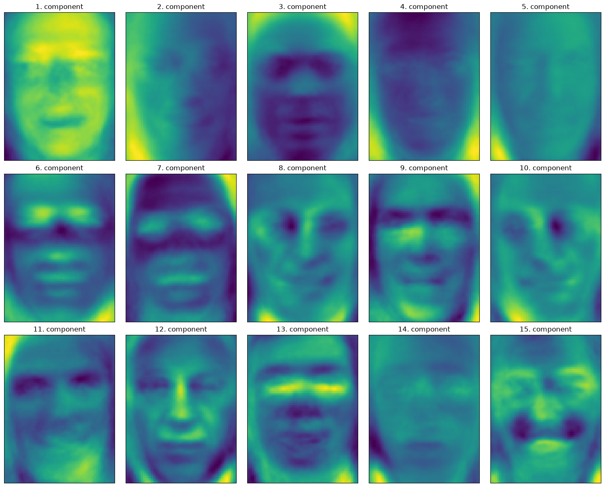

# Facial Recognition with PCA and ANN

This repository contains a complete machine learning pipeline for a Facial Recognition system. The project builds an image classification model using the Labeled Faces in the Wild (LFW) dataset, demonstrating data preprocessing, dimensionality reduction with PCA, baseline classification with K-Nearest Neighbors (KNN), and advanced classification using an Artificial Neural Network (ANN) built with TensorFlow/Keras.

## Project Structure

- `main.py`: The main execution script. It runs the entire pipeline from downloading the dataset to evaluating the ANN model, and outputs visualizations.
- `model.py`: Contains the architectural definitions for the ML models, including PCA, KNN, and the Keras ANN.

## Features & Pipeline

1. **Data Loading & Preprocessing**: Downloads the LFW dataset, displays sample faces, and handles train/test splitting.
2. **Data Balancing**: Filters the dataset to contain a maximum of 50 images per person to balance classes.
3. **Scaling**: Normalizes pixel values for faster convergence and stability.
4. **Baseline Modeling (KNN)**: Evaluates a simple 1-Nearest Neighbor classifier on raw pixels.
5. **Dimensionality Reduction (PCA)**: Uses Principal Component Analysis to reduce features to 100 components, alongside whitening.
6. **PCA Visualizations**: Visualizes the principal components ("eigenfaces") and evaluates KNN on the PCA-transformed data.
7. **Artificial Neural Network (ANN)**: Constructs and trains a multi-layer perceptron (ANN) with ReLU activations and a softmax output layer on the scaled PCA features.

## Setup & Installation

Ensure you have Python 3.7+ installed. We recommend using a virtual environment:

```bash
# Create a virtual environment
python -m venv .venv

# Activate it (Windows)
.\.venv\Scripts\activate
# Activate it (Mac/Linux)
# source .venv/bin/activate

# Install dependencies
pip install -r requirements.txt
```

## 🚀 How to Run the Model

We've made it incredibly easy to execute this pipeline. You have two options:

### Option 1: The One-Click Method (Recommended for Windows)
If you are on Windows, you don't even need to type anything! Simply run one of the included helper scripts which will automatically handle everything for you:
- **Double-click** `run.bat` in your File Explorer.
- OR type `.\run.ps1` in your PowerShell terminal.

### Option 2: The Manual Method (For Mac/Linux or Advanced Users)
If you prefer running it manually, make sure your virtual environment is activated, then simply run:
```bash
python main.py
```

---

## 📊 Outputs on GitHub

When the script runs, it processes the dataset and trains the Neural Network. Instead of freezing your terminal with popup windows, the code is clever: it automatically creates an `images/` folder and saves all the visual outputs directly inside it!

To ensure others can see these visualizations when you upload to GitHub:
1. Run the script locally to generate the images.
2. Ensure you **commit the `images/` directory** along with your code.
3. Once pushed, the images will be visible in the repository.

### Expected Visualizations

**Sample Faces:**


**PCA Components (Eigenfaces):**


*(Note: The images will appear above once you run the code and push the generated `images` folder to GitHub!)*
